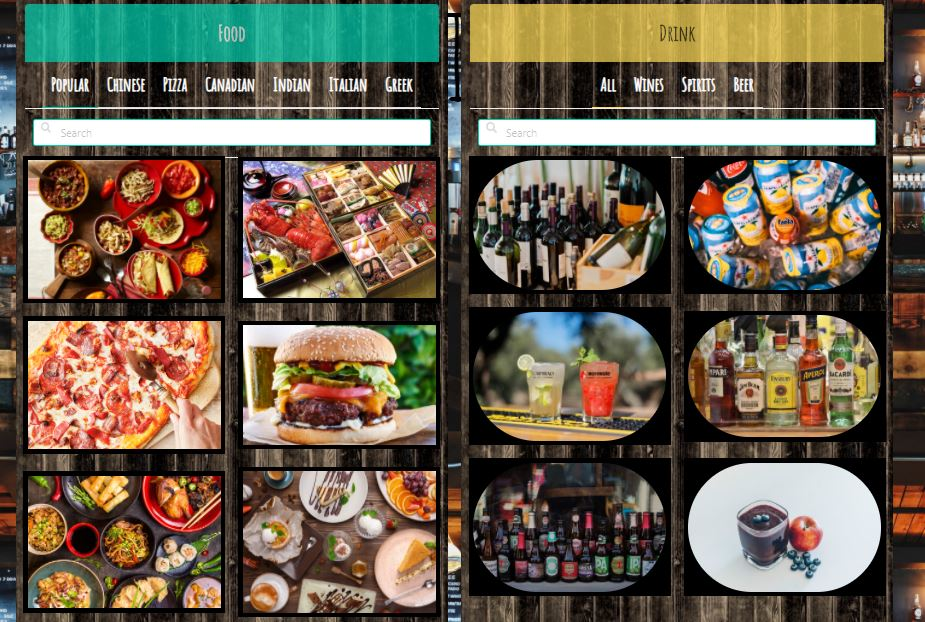

# PerfectPairings

Ever scrolled through ubereats, foodora or ritual and couldn't make a decision you needed a drink?

PerfectPairings will provide you with delicious food options and pair your selection with the perfect drink

Still not convinced? A GIF will Convince!

### Link to deployed website:
https://nagck.github.io/perfectpairings/

# Table of Contents
* [Team Members](#team-members)
* [User Story](#user-story)
* [Usage](#usage)
* [Codes & Sources](#codes-and-sources)
* [APIs Used](#API-used)
* [License](#license)
* [Contributing](#Contributing)

# Team Members

* Chris Burns
* Kevin Sajan
* Nagesh Kalegowda
* Sin Kovac
* Pieter Boerma

# User Story

PERFECT PAIRING TAKES THE GUESSWORK OUT OF PLANNING WHAT YOU ARE GOING TO EAT TONIGHT.
PARTNERING WITH WORLD RENOWNED CULINARY EXPERTS FROM ALL CORNERS OF THE PLANET WE HAVE DEVELOPED AN APP THAT SAVES YOU TIME IN DECISION MAKING AND GIVE IT BACK TO YOU TO ENJOY.
SURPRISE YOUR FRIENDS, FAMILY, PARTNERS OR JUST YOUR TASTEBUDS WITH THE PERFECT COMBINATION OF FOOD AND DRINK.
YOUR FRIENDS WILL THINK YOU ARE A TRENDY TRAVELER WITH MANY INTERNATION FAVORITES AT YOUR FINGERTIPS.
HAS THE FIRE GONE OUT IN YOUR RELATIONSHIP? PERFECT PAIRING IS THE GASOLINE YOU NEED, ALL YOU NEED TO DO IS LIGHT THE MATCH.
JOIN THE FEW, THE PROUD..........THE MEMBERS OF PERFECT..............PAIRING AND LIVE THE GOOD LIFE!

## Usage
<instructions>
You may navigate to each block of content individually by clicking the elements on the navigation bar located at the top of the page
  
  

# Codes and Sources

Javascript
CSS
HTML
Jquery

Google fonts: https://fonts.googleapis.com/css?family=Amatic+SC

Bulma: https://cdn.jsdelivr.net/npm/bulma@0.9.1/css/bulma.min.css

Font awesome: https://use.fontawesome.com/releases/v5.14.0/js/all.js

# API's used

Spoonacular - https://spoonacular.com/food-api

Giphy - https://developers.giphy.com/

## License
MIT License

## Contributing

# Contributor Covenant Code of Conduct

## Our Pledge

We as members, contributors, and leaders pledge to make participation in our
community a harassment-free experience for everyone, regardless of age, body
size, visible or invisible disability, ethnicity, sex characteristics, gender
identity and expression, level of experience, education, socio-economic status,
nationality, personal appearance, race, religion, or sexual identity
and orientation.

We pledge to act and interact in ways that contribute to an open, welcoming,
diverse, inclusive, and healthy community.

## Enforcement Responsibilities

Community leaders are responsible for clarifying and enforcing our standards of
acceptable behavior and will take appropriate and fair corrective action in
response to any behavior that they deem inappropriate, threatening, offensive,
or harmful.

Community leaders have the right and responsibility to remove, edit, or reject
comments, commits, code, wiki edits, issues, and other contributions that are
not aligned to this Code of Conduct, and will communicate reasons for moderation
decisions when appropriate.

## Scope

This Code of Conduct applies within all community spaces, and also applies when
an individual is officially representing the community in public spaces.
Examples of representing our community include using an official e-mail address,
posting via an official social media account, or acting as an appointed
representative at an online or offline event.

## Attribution

This Code of Conduct is adapted from the [Contributor Covenant][homepage],
version 2.0, available at
https://www.contributor-covenant.org/version/2/0/code_of_conduct.html.

Community Impact Guidelines were inspired by [Mozilla's code of conduct
enforcement ladder](https://github.com/mozilla/diversity).

[homepage]: https://www.contributor-covenant.org

For answers to common questions about this code of conduct, see the FAQ at
https://www.contributor-covenant.org/faq. Translations are available at
https://www.contributor-covenant.org/translations.
